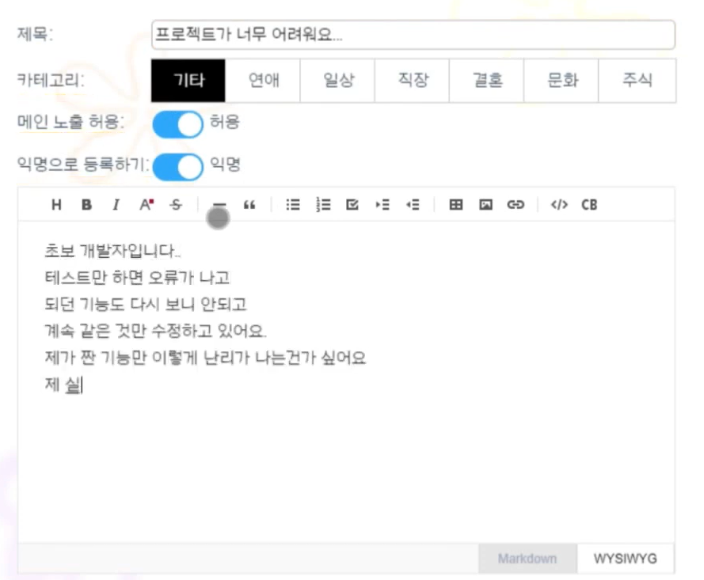
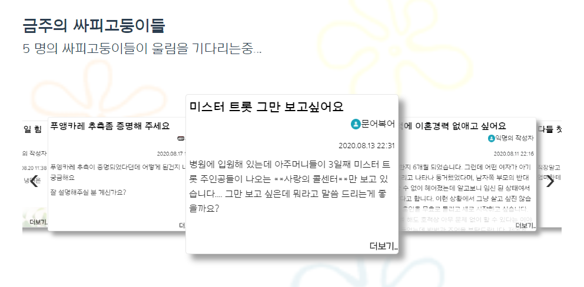
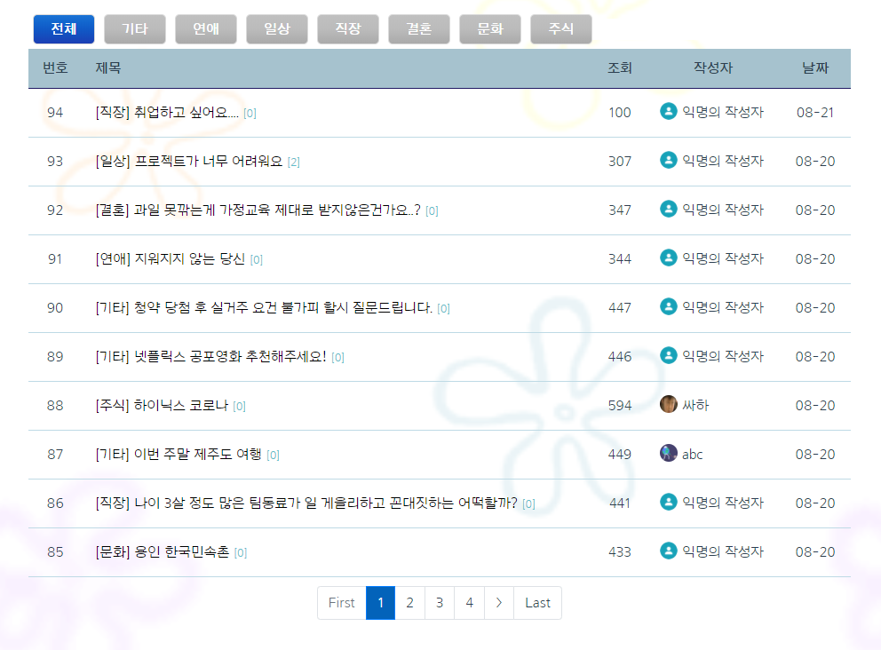
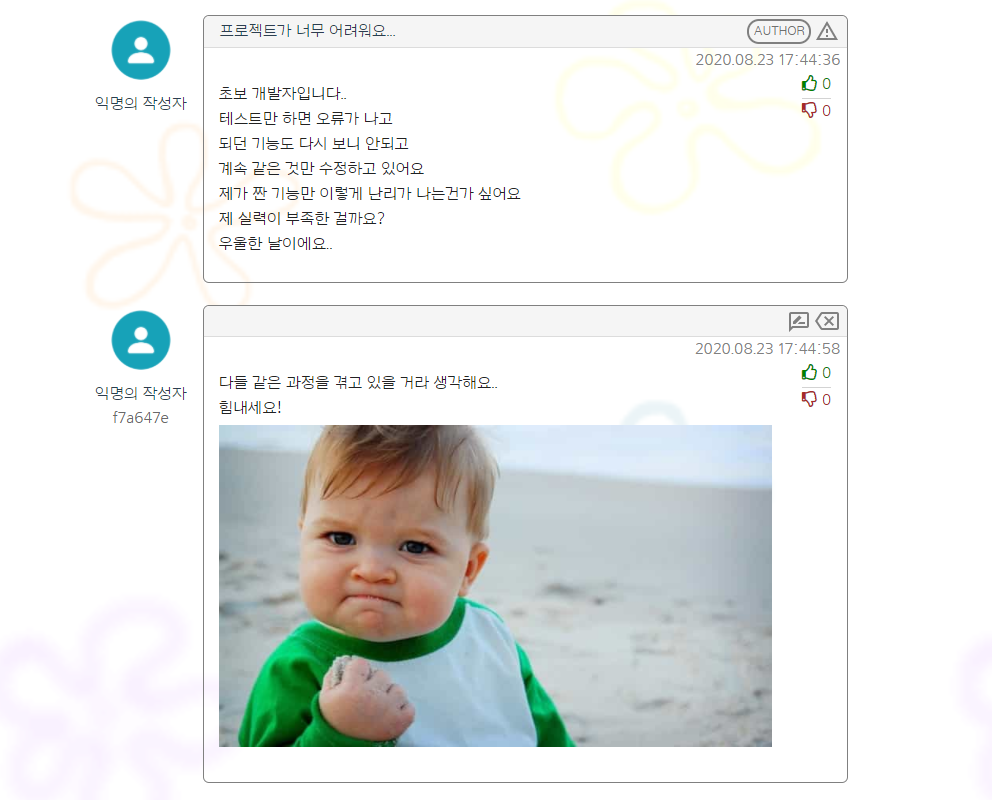
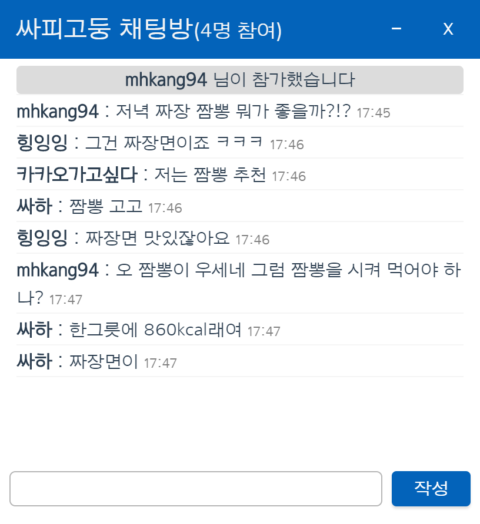
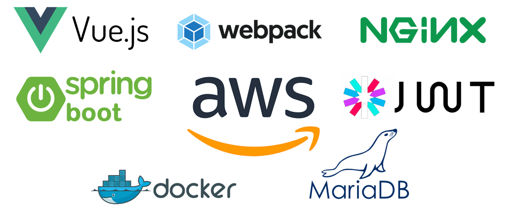

#  마법의 싸피고둥  
> SSAFY 3기 4반 3팀 블사조  

[](https://www.youtube.com/watch?v=yQqSDPEUsyQ)
[](mailto:ssafy.conch@gmail.com)
[](https://lab.ssafy.com/s03-webmobile1-sub3/s03p13a403/blob/master/LICENSE)

<br>

# Overview
> 자유로운 고민 상담 소통 웹 서비스  
> [](http://i3a403.p.ssafy.io/)

<!-- [i3a403.p.ssafy.io](http://i3a403.p.ssafy.io/) -->

현대인이라면 누구라도 크고 작은 고민을 가지고 살아간다.  
이런 고민을 털어놓고 해결해줄 수단이 필요하다.  

> "개인이 가진 고민을 자유롭게 소통할 수 있는 공간을 만들자"

## 🎬 Demo
[](https://www.youtube.com/watch?v=yQqSDPEUsyQ)

<br>

*Write your worries*  
  

<br>

*Explore others worry of waiting for an answer*  
  
  
  

<br>

*Solve your problems by chatting with others*  
  

<br>

# Project Setup
## Requirements
> 프로젝트 실행을 위한 변수 설정
#### ***/frontend/.env***
``` properties
VUE_APP_API_URL=
VUE_APP_KAKAO_API_KEY=
```

#### ***/backend/src/main/resources/application.properties***
``` properties
# Database Settings
spring.datasource.driverClassName=com.mysql.cj.jdbc.Driver
spring.datasource.url=
spring.datasource.username=
spring.datasource.password=

# JWT Expire Time (Minutes)
jwt.expmin=5

# SMTP Mail Account (for authentication)
# gmail을 사용하도록 설정되어 있으며, 필요시 변경할 수 있습니다.
sendmail.email=
sendmail.password=
```

## Build
### Front-end
``` sh
cd frontend
sudo yarn install
sudo yarn build
```

### Back-end
``` sh
cd backend
mvn package
```

## Deployment
### Front-end
``` sh
# ssl 설정이 되어있지 않으므로 http로 동작하도록 설정해주세요.
sudo service nginx start
```

### Back-end
``` sh
cd jar # jar 파일이 위치한 경로
java -jar backend-0.0.1-SNAPSHOT.jar
```

<br>

# 📚 Tech Stack


|Tech   |Version|
|-------|-------|
|Vue.js |2.6.11 |
|webpack|4.44.1 |
|NGINX  |1.14.0 |
|Spring Boot|2.3.1|
|JJWT   |0.9.1  |
|Docker |19.03.12|
|Swagger|2.9.2  |
|Bootstrap|4.5.0  |

<br>

# ✨ Contributors
|name|github|tech|
|----|------|----|
|김현욱|[Hyeon-uk](https://github.com/tristan3716)|Full-stack, Deployment|
|강명훈|[MyungHunKang](https://github.com/MHKANG)|Back-end, Database|
|김성민|[dia321](https://github.com/dia321)|Front-end, Design|
|서정하|[rodash3](https://github.com/rodash3)|Front-end, UCC|
|이성현|[lshmn951](https://github.com/lshmn951)|Full-stack, AWS|

<br>

# 📄 Documents
<a href="https://drive.google.com/drive/u/0/folders/1RTENo2sIWKJZDlXICJTc1DmMOvgN5L6U"
    title="액세스 권한이 필요합니다.">
    Google drive - Architecture Design
</a>
<br>
<a href="https://drive.google.com/drive/u/0/folders/1tBk0jsdfG7nXcmbEDDHspX8_JKCYea03">
    Google drive - Resoures (ucc, images)
</a>

<br>

# ⚖️ License
Copyright © 2020 BLSA  
<i class="fa fa-balance-scale fa-fw"></i>This project is licensed under the **MIT License**